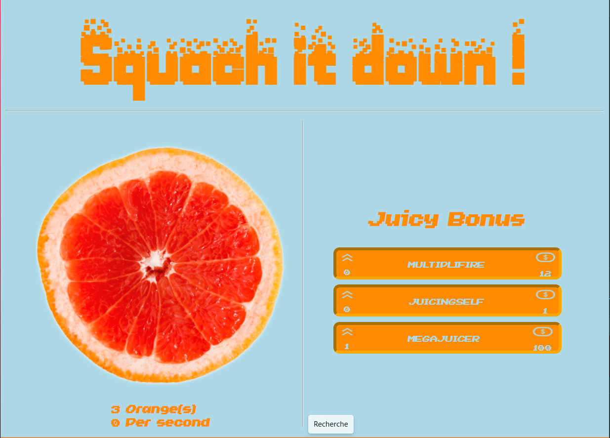

# Squash it Down 
## _The Orange Clicker_

[Squash it Down](https://killiandmt.github.io/ClickerBecode/) 

## HTML / CSS Structure 

Working from the start from a hand drawn sketch Celia Build the Html/CSS structure for our project. 

## JS 

Splitting the work between the 3 of us, we made 3 different JS files and merged them together by keeping the optimal part again and again...

We encountered a few problems along the way,... 
- The boost option with the timer on click was tricky to put in the code without conflict with the 2 others
- the auto-click was for me a hard one too, with the setInterval() function

## Incoming Changes...

We still are thinking about some stuff to had to this project.. 